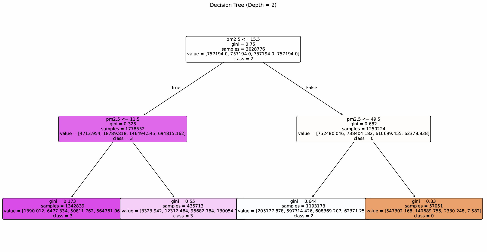
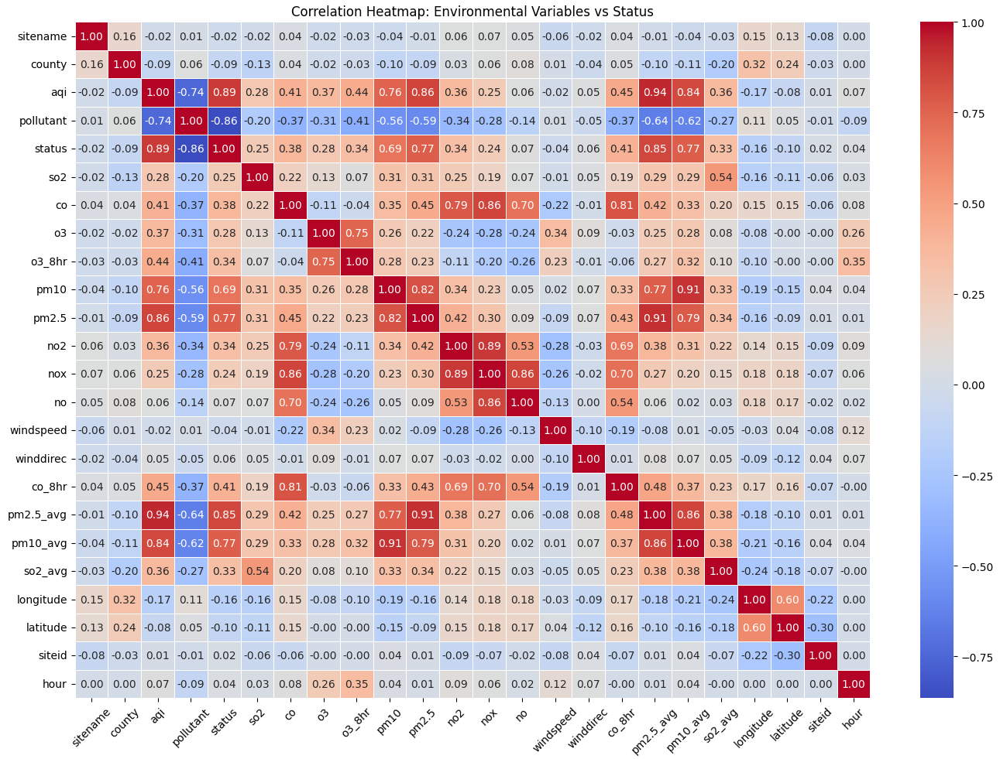
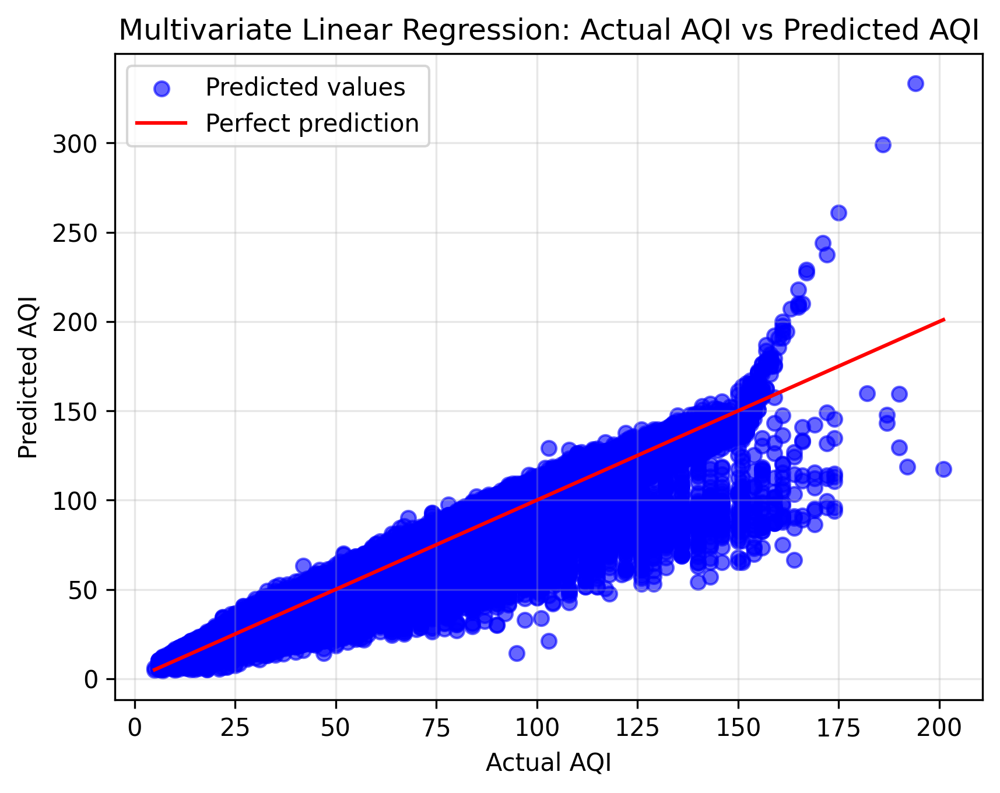

# Air Quality Prediction and Classification using Machine Learning



## Overview

This project presents an end-to-end Machine Learning workflow for air quality analysis, prediction and classification using real-world environmental data collected across Taiwan between 2016 and 2024.

The goal is to explore how pollutant concentrations, weather conditions, temporal patterns and geographical information can be used to estimate air quality levels and support data-driven environmental analysis.

The project combines exploratory data analysis, feature engineering, classification models and regression techniques to build interpretable predictive models for air quality monitoring.

---

## Project Highlights

* Built a complete supervised Machine Learning pipeline from raw data to model evaluation
* Analyzed millions of environmental observations collected over multiple years
* Developed classification models to predict air quality status categories
* Implemented regression models to estimate numerical AQI values
* Compared linear and non-linear approaches for AQI prediction
* Used visual analysis to interpret feature relationships and model behavior
* Focused on explainability through interpretable models such as Decision Trees

---

## Dataset

**Taiwan Air Quality Index Dataset (2016–2024)**

The dataset contains large-scale environmental measurements collected from air quality monitoring stations across Taiwan.

It includes several air pollution and contextual features such as:

* PM2.5
* PM10
* O3
* CO
* NO2
* SO2
* Wind speed and wind direction
* Geographical coordinates
* Temporal information
* AQI values
* Air quality status categories

This makes the dataset suitable for both classification and regression tasks.

---

## Exploratory Data Analysis

The first phase of the project focused on understanding the structure and quality of the dataset.

The analysis included:

* Missing value inspection and cleaning
* Statistical summaries of numerical variables
* Feature distribution analysis
* Correlation analysis between pollutants and AQI-related variables
* Visualization of relationships between air pollutants and air quality status

### Correlation Analysis



The correlation heatmap highlights strong relationships between pollutant concentrations and air quality indicators. In particular, particulate matter features such as PM2.5 and PM10 showed a significant influence on air quality classification and AQI prediction.

These insights were used to guide feature selection and model development.

---

## Machine Learning Models

## Decision Tree Classification

A Decision Tree classifier was developed to predict air quality status categories from environmental measurements.

This model was selected because it provides both predictive capability and interpretability. Unlike black-box models, Decision Trees make it possible to understand which features are most relevant and how the model creates decision rules.

The model was trained using pollutant concentrations, weather-related variables, temporal information and geographical coordinates.

Key aspects analyzed:

* Feature importance
* Tree depth impact
* Classification accuracy
* Confusion matrix interpretation
* Model performance on frequent and rare air quality classes

The Decision Tree showed that PM2.5 plays a highly relevant role in separating air quality categories, confirming its importance as a key indicator of pollution severity.

---

## Regression Analysis



Multivariate Linear Regression was implemented to estimate AQI values using multiple environmental features.

The objective was to create a baseline regression model capable of learning the relationship between pollutant concentrations and AQI values.

The model was evaluated using standard regression metrics such as:

* Mean Squared Error
* Mean Absolute Error
* Root Mean Squared Error
* R² Score

The results showed a strong relationship between real and predicted AQI values, confirming that pollutant measurements contain meaningful predictive information for air quality estimation.

---

## Polynomial Regression

To capture non-linear relationships between environmental variables and AQI, Polynomial Regression was also implemented.

This approach extends the linear model by introducing polynomial terms and feature interactions, allowing the model to better represent complex patterns in the data.

Polynomial Regression improved the predictive performance compared to the baseline linear model, showing that air quality dynamics are not always purely linear and can benefit from more flexible modeling techniques.

---

## Machine Learning Pipeline

The project follows a complete supervised learning workflow:

### 1. Data Preparation

* Dataset loading
* Missing value handling
* Data cleaning
* Feature selection
* Categorical encoding
* AQI discretization
* Train-test split

### 2. Exploratory Data Analysis

* Statistical summaries
* Correlation heatmaps
* Scatter plots
* Feature relationship analysis
* Pollutant impact analysis

### 3. Model Training

* Decision Tree Classification
* Multivariate Linear Regression
* Polynomial Regression

### 4. Model Evaluation

* Accuracy analysis
* Confusion matrix
* Regression error metrics
* Actual vs predicted comparison
* Model interpretation

---

## Technologies Used

* Python
* Google Colab
* Pandas
* NumPy
* Scikit-Learn
* Matplotlib
* Seaborn

---

## Repository Structure

```text
Air-Quality-Prediction-ML/
│
├── 01_Data_Preprocessing.ipynb
├── 02_Decision_Tree_Classification.ipynb
├── 03_Linear_and_Polynomial_Regression.ipynb
│
├── images/
│   ├── decision_tree_model.png
│   ├── correlation_heatmap.png
│   └── Multivariate_regression_plot.png
│
└── README.md
```

---

## Key Concepts

This project covers several core Machine Learning and Data Science concepts:

* Supervised Learning
* Classification
* Regression
* Feature Engineering
* Data Cleaning
* Exploratory Data Analysis
* Model Evaluation
* Decision Trees
* Linear Regression
* Polynomial Regression
* Environmental Data Analysis
* Model Interpretability

---

## Why This Project Matters

Air pollution is a critical environmental and public health issue. Being able to analyze pollutant concentrations and predict air quality conditions can help support better monitoring, awareness and decision-making.

This project demonstrates how Machine Learning can be applied to real-world environmental data to extract meaningful insights, build predictive models and better understand the factors that influence air quality.

---

## Author

**Renzo Albertini**
Electronic and Computer Engineering Student
Machine Learning & Data Analysis Project

